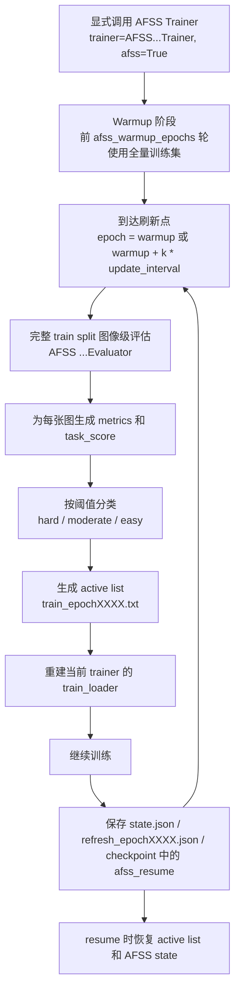

# AFSS 使用说明

## 1. 文档目的

本文档说明当前仓库中 AFSS（Anti-Forgetting Sampling Strategy）的使用方式与实现细节，重点覆盖以下内容：

- `detect`、`segment`、`pose`、`obb` 四个任务如何训练。
- 四个任务的样本分级依据是什么。
- 图像级指标是如何计算的。
- easy、moderate、hard 三类样本如何划分。
- AFSS 在每个 epoch 如何刷新样本状态、生成活跃训练集、恢复断点训练。
- 关键实现代码分别位于哪些文件。

当前实现是“显式启用、默认不影响原有训练路径”的设计：

- 默认 `model.train(...)` 不会自动开启 AFSS。
- 只有显式传入 AFSS trainer，并同时设置 `afss=True` 时，才会进入 AFSS 训练路径。

---

## 2. AFSS 的核心思路

AFSS 的目标是把训练样本按“当前任务是否已经学会”分成不同难度层级，再用不同的采样策略控制每轮训练真正参与的图片集合。

简单理解：

- `hard`：当前图像对模型来说还难，始终保留。
- `moderate`：模型部分掌握，按比例保留，并设置强制覆盖机制。
- `easy`：模型基本掌握，少量保留，并设置强制回看机制。

AFSS 不直接修改原始数据集标注，也不改默认 `DetectionTrainer / SegmentationTrainer / PoseTrainer / OBBTrainer` 的选择逻辑，而是通过以下方式工作：

1. 在 warmup 阶段使用全量训练集。
2. 周期性用 AFSS evaluator 在完整 train split 上做一次图像级评估。
3. 为每张图计算图像级任务分数 `task_score`。
4. 根据阈值把图像分成 easy / moderate / hard。
5. 按规则生成新的活跃训练列表 `train_epochXXXX.txt`。
6. 仅重建 AFSS trainer 自己的 `train_loader`，让后续训练使用该活跃子集。

---

## 3. AFSS 总体流程



---

## 4. 显式启用方式

### 4.1 通用原则

AFSS 必须显式注入 trainer。

也就是说，你不能只写：

```python
model.train(afss=True, ...)
```

你必须写成：

```python
model.train(trainer=某个 AFSS Trainer, afss=True, ...)
```

这样做的目的是确保默认训练入口完全不变。

相关实现与验证位置：

- 默认配置与开关：`ultralytics/cfg/default.yaml`
- 配置类型注册：`ultralytics/cfg/__init__.py`
- 默认路径不自动启用 AFSS 的测试：`tests/test_afss_config.py`
- 示例脚本：`train_afss.py`

### 4.2 通用 AFSS 参数

当前仓库中 AFSS 相关参数如下：

| 参数 | 含义 | 默认值 |
| --- | --- | --- |
| `afss` | 是否启用 AFSS | `False` |
| `afss_warmup_epochs` | warmup 轮数，warmup 期间使用全量数据 | `20` |
| `afss_update_interval` | AFSS 刷新周期 | `5` |
| `afss_easy_ratio` | easy 样本每轮采样比例 | `0.02` |
| `afss_moderate_ratio` | moderate 样本每轮采样比例 | `0.40` |
| `afss_easy_forced_gap` | easy 样本超过多少轮未被使用则强制回看 | `10` |
| `afss_moderate_forced_gap` | moderate 样本超过多少轮未被使用则强制覆盖 | `3` |
| `afss_conf` | AFSS 全量 train 评估时使用的置信度阈值 | `0.25` |
| `afss_save_refresh_json` | 是否保存每次刷新后的调试 JSON | `False` |
| `afss_thresholds` | 每个任务的 `[moderate_threshold, easy_threshold]` | `detect/obb/segment/pose = [0.55, 0.85]` |

参数定义位置：

- `ultralytics/cfg/default.yaml`

---

## 5. detect 训练教程

### 5.1 最小示例

```python
from ultralytics import YOLO
from ultralytics.models.yolo.detect.afss_train import AFSSDetectionTrainer

model = YOLO("yolo26n.yaml")
model.train(
    trainer=AFSSDetectionTrainer,
    afss=True,
    data="coco8.yaml",
    imgsz=640,
    epochs=100,
    batch=16,
    afss_warmup_epochs=20,
    afss_update_interval=5,
    afss_easy_ratio=0.02,
    afss_moderate_ratio=0.40,
    afss_easy_forced_gap=10,
    afss_moderate_forced_gap=3,
    afss_conf=0.25,
    afss_thresholds={"detect": [0.55, 0.85]},
)
```

### 5.2 仓库现成脚本

当前仓库已提供 detect 示例脚本：

- `train_afss.py`

这个脚本已经采用显式 trainer 注入方式：

```python
model.train(trainer=AFSSDetectionTrainer, afss=True, ...)
```

### 5.3 detect 关键实现

- Trainer：`ultralytics/models/yolo/detect/afss_train.py`
- Evaluator：`ultralytics/models/yolo/detect/afss_val.py`
- 测试：
  - `tests/test_afss_detect_train.py`
  - `tests/test_afss_detect_eval.py`

---

## 6. segment 训练教程

### 6.1 最小示例

```python
from ultralytics import YOLO
from ultralytics.models.yolo.segment.afss_train import AFSSSegmentationTrainer

model = YOLO("yolo26n-seg.yaml")
model.train(
    trainer=AFSSSegmentationTrainer,
    afss=True,
    data="coco8-seg.yaml",
    imgsz=640,
    epochs=100,
    batch=16,
    afss_warmup_epochs=20,
    afss_update_interval=5,
    afss_easy_ratio=0.02,
    afss_moderate_ratio=0.40,
    afss_easy_forced_gap=10,
    afss_moderate_forced_gap=3,
    afss_conf=0.25,
    afss_thresholds={"segment": [0.55, 0.85]},
)
```

### 6.2 segment 关键实现

- Trainer：`ultralytics/models/yolo/segment/afss_train.py`
- Evaluator：`ultralytics/models/yolo/segment/afss_val.py`
- 原始基类：
  - `ultralytics/models/yolo/segment/train.py`
  - `ultralytics/models/yolo/segment/val.py`
- 测试：`tests/test_afss_segment.py`

---

## 7. pose 训练教程

### 7.1 最小示例

```python
from ultralytics import YOLO
from ultralytics.models.yolo.pose.afss_train import AFSSPoseTrainer

model = YOLO("yolo26n-pose.yaml")
model.train(
    trainer=AFSSPoseTrainer,
    afss=True,
    data="coco8-pose.yaml",
    imgsz=640,
    epochs=100,
    batch=16,
    afss_warmup_epochs=20,
    afss_update_interval=5,
    afss_easy_ratio=0.02,
    afss_moderate_ratio=0.40,
    afss_easy_forced_gap=10,
    afss_moderate_forced_gap=3,
    afss_conf=0.25,
    afss_thresholds={"pose": [0.55, 0.85]},
)
```

### 7.2 pose 关键实现

- Trainer：`ultralytics/models/yolo/pose/afss_train.py`
- Evaluator：`ultralytics/models/yolo/pose/afss_val.py`
- 原始基类：
  - `ultralytics/models/yolo/pose/train.py`
  - `ultralytics/models/yolo/pose/val.py`
- 测试：`tests/test_afss_pose.py`

---

## 8. obb 训练教程

### 8.1 最小示例

```python
from ultralytics import YOLO
from ultralytics.models.yolo.obb.afss_train import AFSSOBBTrainer

model = YOLO("yolo26n-obb.yaml")
model.train(
    trainer=AFSSOBBTrainer,
    afss=True,
    data="dota8.yaml",
    imgsz=640,
    epochs=100,
    batch=16,
    afss_warmup_epochs=20,
    afss_update_interval=5,
    afss_easy_ratio=0.02,
    afss_moderate_ratio=0.40,
    afss_easy_forced_gap=10,
    afss_moderate_forced_gap=3,
    afss_conf=0.25,
    afss_thresholds={"obb": [0.55, 0.85]},
)
```

### 8.2 obb 关键实现

- Trainer：`ultralytics/models/yolo/obb/afss_train.py`
- Evaluator：`ultralytics/models/yolo/obb/afss_val.py`
- 原始基类：
  - `ultralytics/models/yolo/obb/train.py`
  - `ultralytics/models/yolo/obb/val.py`
- 测试：`tests/test_afss_obb.py`

---

## 9. 四个任务的样本分类依据

这一节是 AFSS 最核心的部分。

AFSS 不是根据 loss、类别频次、标注框数量来分级，而是根据“图像级任务充分性分数 `task_score`”来分级。

### 9.1 通用分级流程

对每张训练图像，AFSS evaluator 会先得到一个图像级 `metrics` 字典，再由 adapter 把它压缩成一个标量 `task_score`，最后再根据阈值分成 easy / moderate / hard。

通用流程如下：

1. 对单张图像统计该图像上的 GT 数量、预测数量、匹配数量。
2. 计算该图像的图像级 precision / recall。
3. 根据任务类型组织成对应 `metrics`。
4. 使用任务 adapter 计算 `task_score`。
5. 使用阈值进行分桶。

相关代码位置：

- 通用 adapter：`ultralytics/afss/adapters.py`
- 通用分桶与采样：`ultralytics/afss/scheduler.py`
- 通用 evaluator payload：`ultralytics/afss/base_evaluator.py`

### 9.2 easy / moderate / hard 的判定规则

分桶逻辑定义在：

- `ultralytics/afss/scheduler.py`

判定函数：

```python
if score < moderate_threshold:
    return "hard"
if score <= easy_threshold:
    return "moderate"
return "easy"
```

因此边界是：

- `score < moderate_threshold` -> `hard`
- `moderate_threshold <= score <= easy_threshold` -> `moderate`
- `score > easy_threshold` -> `easy`

以默认阈值 `[0.55, 0.85]` 为例：

- `score < 0.55` -> hard
- `0.55 <= score <= 0.85` -> moderate
- `score > 0.85` -> easy

注意这是闭区间边界：

- `score == 0.55` 属于 `moderate`
- `score == 0.85` 也属于 `moderate`

---

## 10. 图像级 precision / recall 的通用计算方式

四个任务虽然头部不同，但图像级 precision / recall 的计算框架一致。

### 10.1 基本记号

- `num_gt`：该图像的 GT 实例数量
- `num_pred`：该图像的预测实例数量
- `matched_gt`：该图像中成功匹配到的 GT 数量
- `matched_pred`：该图像中成功匹配到的预测数量

对 detect / obb，`matched_gt` 与 `matched_pred` 使用同一组匹配计数。

对 segment / pose，还会额外统计：

- `matched_mask_gt` / `matched_mask_pred`
- `matched_pose_gt` / `matched_pose_pred`

### 10.2 通用公式

图像级 recall：

```text
if num_gt == 0:
    recall = 1.0
else:
    recall = matched_gt / num_gt
```

图像级 precision：

```text
if num_pred == 0:
    if num_gt == 0:
        precision = 1.0
    else:
        precision = 0.0
else:
    precision = matched_pred / num_pred
```

这意味着几个重要边界情况：

1. 背景图像，没有 GT，也没有预测：
   - `precision = 1.0`
   - `recall = 1.0`

2. 有 GT，但模型一个也没预测出来：
   - `precision = 0.0`
   - `recall = 0.0`

3. 没有 GT，但模型预测出目标：
   - `recall = 1.0`
   - `precision = matched_pred / num_pred`
   - 如果这些预测全是误报，通常 precision 会接近 `0.0`

---

## 11. detect 的样本分类指标与计算

### 11.1 detect 使用什么指标

`detect` 只看 box 头。

其图像级 `metrics` 结构为：

```python
{
    "box": {
        "precision": ...,
        "recall": ...,
    }
}
```

代码位置：

- 图像级聚合：`ultralytics/models/yolo/detect/afss_val.py`
- 任务 adapter：`ultralytics/afss/adapters.py` 中的 `DetectAdapter`

### 11.2 detect 的 task_score 怎么算

`DetectAdapter` 的逻辑是：

```text
task_score = min(box_precision, box_recall)
```

也就是说，detect 图像是否“容易”，取决于这张图在 box 精度和 box 召回里最差的那个值。

### 11.3 detect 的匹配统计从哪里来

在：

- `ultralytics/models/yolo/detect/afss_val.py`

AFSS detect evaluator 会复用 detection validator 的 `_process_batch(...)`，然后读取：

- `processed["tp"][:, 0]`

这里的第 0 列表示 IoU 阈值序列中的第一列匹配结果。AFSS 当前实现直接拿它做图像级匹配计数：

```python
matched = int(processed["tp"][:, 0].sum()) if processed["tp"].size else 0
```

随后构造：

```text
num_gt = 当前图像 GT 数
num_pred = 当前图像预测数
matched_gt = matched
matched_pred = matched
```

---

## 12. obb 的样本分类指标与计算

### 12.1 obb 使用什么指标

`obb` 只看 rotated box 头。

其图像级 `metrics` 结构为：

```python
{
    "obb": {
        "precision": ...,
        "recall": ...,
    }
}
```

代码位置：

- 图像级聚合：`ultralytics/models/yolo/obb/afss_val.py`
- 任务 adapter：`ultralytics/afss/adapters.py` 中的 `OBBAdapter`

### 12.2 obb 的 task_score 怎么算

`OBBAdapter` 的逻辑是：

```text
task_score = min(obb_precision, obb_recall)
```

### 12.3 obb 的匹配统计从哪里来

在：

- `ultralytics/models/yolo/obb/val.py`

`OBBValidator._process_batch(...)` 使用旋转框 IoU：

```python
iou = batch_probiou(batch["bboxes"], preds["bboxes"])
```

然后把匹配结果写进：

- `processed["tp"]`

AFSS OBB evaluator 在：

- `ultralytics/models/yolo/obb/afss_val.py`

中读取 `processed["tp"][:, 0]` 来统计图像级匹配数量，再计算 precision / recall。

---

## 13. segment 的样本分类指标与计算

### 13.1 segment 使用什么指标

`segment` 同时看 box 头和 mask 头。

其图像级 `metrics` 结构为：

```python
{
    "box": {
        "precision": ...,
        "recall": ...,
    },
    "mask": {
        "precision": ...,
        "recall": ...,
    }
}
```

代码位置：

- 图像级聚合：`ultralytics/models/yolo/segment/afss_val.py`
- 任务 adapter：`ultralytics/afss/adapters.py` 中的 `SegmentAdapter`

### 13.2 segment 的 task_score 怎么算

`SegmentAdapter` 会把 box 和 mask 两个头全部纳入，然后取最小值：

```text
task_score = min(
    box_precision,
    box_recall,
    mask_precision,
    mask_recall,
)
```

这意味着一张图只有在 box 和 mask 都足够稳定时，才会变成 easy。

### 13.3 segment 的匹配统计从哪里来

在：

- `ultralytics/models/yolo/segment/val.py`

`SegmentationValidator._process_batch(...)` 会同时返回：

- `tp`：box 匹配结果
- `tp_m`：mask 匹配结果

AFSS segment evaluator 在：

- `ultralytics/models/yolo/segment/afss_val.py`

中分别统计：

```python
matched_box = int(processed["tp"][:, 0].sum()) if processed["tp"].size else 0
matched_mask = int(processed["tp_m"][:, 0].sum()) if processed["tp_m"].size else 0
```

然后分别计算 box 与 mask 的图像级 precision / recall。

---

## 14. pose 的样本分类指标与计算

### 14.1 pose 使用什么指标

`pose` 同时看 box 头和 pose 头。

其图像级 `metrics` 结构为：

```python
{
    "box": {
        "precision": ...,
        "recall": ...,
    },
    "pose": {
        "precision": ...,
        "recall": ...,
    }
}
```

代码位置：

- 图像级聚合：`ultralytics/models/yolo/pose/afss_val.py`
- 任务 adapter：`ultralytics/afss/adapters.py` 中的 `PoseAdapter`

### 14.2 pose 的 task_score 怎么算

`PoseAdapter` 的逻辑是：

```text
task_score = min(
    box_precision,
    box_recall,
    pose_precision,
    pose_recall,
)
```

也就是说，`pose` 不会只看框对不对，还要求关键点头也表现良好。

### 14.3 pose 的匹配统计从哪里来

在：

- `ultralytics/models/yolo/pose/val.py`

`PoseValidator._process_batch(...)` 会同时返回：

- `tp`：box 匹配结果
- `tp_p`：pose 匹配结果

其中 pose 匹配使用关键点 IoU：

```python
iou = kpt_iou(batch["keypoints"], preds["keypoints"], sigma=self.sigma, area=area)
```

AFSS pose evaluator 在：

- `ultralytics/models/yolo/pose/afss_val.py`

中分别统计：

```python
matched_box = int(processed["tp"][:, 0].sum()) if processed["tp"].size else 0
matched_pose = int(processed["tp_p"][:, 0].sum()) if processed["tp_p"].size else 0
```

随后构造图像级 box / pose precision 与 recall。

---

## 15. 为什么 task_score 一律取最小值

当前仓库的 AFSS adapter 设计是保守策略：只要某个关键头部还不稳定，该图像就不能被视为“真正容易”。

对应代码：

- `ultralytics/afss/adapters.py`

其通用逻辑是：

```python
def score(self, metrics):
    return min(self._collect_values(metrics))
```

也就是说：

- detect：看 `box` 的最小值
- obb：看 `obb` 的最小值
- segment：看 `box + mask` 的全部值中的最小值
- pose：看 `box + pose` 的全部值中的最小值

这种设计的含义是：

- 只要某个头部 recall 很低，该图依然是 hard 或 moderate。
- 只要某个头部 precision 很差，该图也不会被提早归为 easy。

---

## 16. AFSS 的活跃集选择规则

活跃集选择逻辑位于：

- `ultralytics/afss/scheduler.py`

### 16.1 hard 样本

`hard` 样本始终保留：

```python
selected = {state.im_file for state in grouped["hard"]}
```

### 16.2 easy 样本

easy 样本有两种进入活跃集的方式：

1. 强制回看：
   - 如果 `current_epoch - last_used_epoch >= afss_easy_forced_gap`
   - 则必须回到活跃集

2. 按比例采样：
   - 采样数为 `ceil(len(easy_bucket) * afss_easy_ratio)`

### 16.3 moderate 样本

moderate 样本也有两种进入活跃集的方式：

1. 强制覆盖：
   - 如果 `current_epoch - last_used_epoch >= afss_moderate_forced_gap`
   - 则必须进入活跃集

2. 按比例采样：
   - 采样数为 `ceil(len(moderate_bucket) * afss_moderate_ratio)`

### 16.4 排序规则

无论是强制回看还是比例采样，都优先选择“最久没被使用”的样本。

排序函数：

```python
key=lambda state: (-(current_epoch - state.last_used_epoch), state.im_file)
```

也就是说：

- 先按“距上次使用已经过去多少轮”降序排序
- 如果并列，再按文件名排序

### 16.5 最终 active list

最终 active list 为：

```text
hard 全量
+ easy 强制回看
+ moderate 强制覆盖
+ easy 按比例采样
+ moderate 按比例采样
```

最后统一排序并写入：

- `runs/.../afss/train_epochXXXX.txt`

写文件逻辑位于：

- `ultralytics/afss/io.py`
- `ultralytics/models/yolo/detect/afss_train.py` 中的 `_write_active_train_list(...)`

---

## 17. AFSS 状态、产物与断点恢复

### 17.1 单图状态

AFSS 为每张图维护 `AFSSImageState`：

- `im_file`
- `last_used_epoch`
- `last_eval_epoch`
- `task_score`
- `level`
- `metrics`

定义位置：

- `ultralytics/afss/state.py`

### 17.2 运行产物

AFSS 运行时会在：

- `runs/.../afss/`

下生成若干文件。

常见文件包括：

- `state.json`
  - 当前 AFSS 全量状态快照
- `train_epoch000X.txt`
  - 某次刷新后生成的活跃训练列表
- `refresh_epoch000X.json`
  - 当 `afss_save_refresh_json=True` 时生成的详细刷新记录

对应实现位置：

- 状态读写：`ultralytics/afss/io.py`
- trainer 内的保存恢复：
  - `ultralytics/models/yolo/detect/afss_train.py`
  - `ultralytics/models/yolo/obb/afss_train.py`
  - `ultralytics/models/yolo/segment/afss_train.py`
  - `ultralytics/models/yolo/pose/afss_train.py`

### 17.3 refresh JSON 里有什么

当 `afss_save_refresh_json=True` 时，会写入：

- `epoch`
- `task`
- `thresholds`
- `counts`
- `active_count`
- `active_images`
- `images`

其中 `images` 是按 `task_score` 从高到低排序后的完整图像状态快照。

### 17.4 resume 怎么恢复

AFSS 不仅把状态写到 `state.json`，也把 resume 元数据写进 checkpoint：

- `afss_resume.active_list_epoch`
- `afss_resume.active_list_name`
- `afss_resume.state`

恢复逻辑在：

- `ultralytics/models/yolo/detect/afss_train.py`

其余任务 trainer 通过继承同一套逻辑复用。

恢复时大致流程如下：

1. 先走原始 trainer 的标准恢复逻辑。
2. 再恢复 AFSS state。
3. 如果恢复点已经超过 warmup，则尝试恢复上一次生效的 active list。
4. 若 checkpoint 没带 active list，但 AFSS state 仍在，则重新根据 state 计算活跃样本并重建 loader。

---

## 18. warmup、刷新与 train_loader 重建

### 18.1 warmup 期间

在：

- `ultralytics/models/yolo/detect/afss_train.py`

中，`_use_full_dataset(epoch)` 的规则是：

```python
return epoch < self.args.afss_warmup_epochs
```

即：

- `epoch < afss_warmup_epochs` 时，仍然用全量训练集。
- `epoch == afss_warmup_epochs` 时，warmup 结束，可以开始第一次 AFSS 刷新。

### 18.2 刷新时机

刷新判断：

```python
if not self.afss_enabled or self._use_full_dataset(epoch):
    return False
return (epoch - self.args.afss_warmup_epochs) % self.args.afss_update_interval == 0
```

例如默认：

- `afss_warmup_epochs = 20`
- `afss_update_interval = 5`

则刷新点为：

- `20, 25, 30, 35, ...`

### 18.3 只重建 AFSS trainer 的 train_loader

AFSS 不会全局替换数据集，只会对当前 AFSS trainer 调用：

```python
self.train_loader = self.get_dataloader(str(list_path), ...)
```

实现位置：

- `ultralytics/models/yolo/detect/afss_train.py` 中的 `_rebuild_train_loader_from_list(...)`

相关兼容性修改：

- `ultralytics/engine/trainer.py`
- `tests/test_engine.py`

这部分修改的目的，是让训练循环在 epoch 开始时如果 `train_loader` 被回调更换，进度条和 batch 偏移量也能正确工作。

---

## 19. 代码索引总表

### 19.1 配置与入口

- `ultralytics/cfg/default.yaml`
- `ultralytics/cfg/__init__.py`
- `train_afss.py`
- `tests/test_afss_config.py`

### 19.2 AFSS 通用核心

- `ultralytics/afss/__init__.py`
- `ultralytics/afss/state.py`
- `ultralytics/afss/io.py`
- `ultralytics/afss/scheduler.py`
- `ultralytics/afss/adapters.py`
- `ultralytics/afss/base_evaluator.py`

### 19.3 detect

- `ultralytics/models/yolo/detect/afss_train.py`
- `ultralytics/models/yolo/detect/afss_val.py`
- `tests/test_afss_detect_train.py`
- `tests/test_afss_detect_eval.py`

### 19.4 obb

- `ultralytics/models/yolo/obb/afss_train.py`
- `ultralytics/models/yolo/obb/afss_val.py`
- `tests/test_afss_obb.py`

### 19.5 segment

- `ultralytics/models/yolo/segment/afss_train.py`
- `ultralytics/models/yolo/segment/afss_val.py`
- `tests/test_afss_segment.py`

### 19.6 pose

- `ultralytics/models/yolo/pose/afss_train.py`
- `ultralytics/models/yolo/pose/afss_val.py`
- `tests/test_afss_pose.py`

---

## 20. 推荐阅读顺序

如果你是第一次接触这个实现，建议按下面顺序阅读：

1. `train_afss.py`
   - 先看如何显式启用 AFSS。
2. `ultralytics/cfg/default.yaml`
   - 了解所有 AFSS 参数。
3. `ultralytics/models/yolo/detect/afss_train.py`
   - 看完整主流程，detect 是所有任务的基线实现。
4. `ultralytics/afss/scheduler.py`
   - 看 easy / moderate / hard 的分桶和采样规则。
5. `ultralytics/afss/adapters.py`
   - 看四个任务的 `task_score` 定义。
6. 各任务 `afss_val.py`
   - 看每个任务的图像级指标是怎么聚合出来的。
7. 各任务测试文件
   - 用测试反向理解设计边界与预期行为。

---

## 21. 一句话总结

当前仓库中的 AFSS 是一个“显式注入、按图像级任务充分性分数进行样本分级、并通过活跃训练列表动态重建 train_loader”的多任务训练路径：

- `detect` 看 `box`
- `obb` 看 `obb`
- `segment` 看 `box + mask`
- `pose` 看 `box + pose`

四个任务最终都把图像压缩成一个 `task_score`，再按阈值分成 easy / moderate / hard，并结合强制回看、强制覆盖与比例采样策略生成每一轮真正训练的样本集合。
